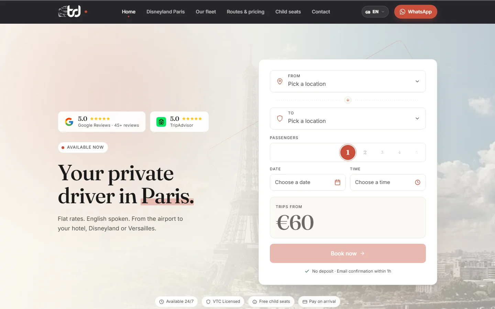
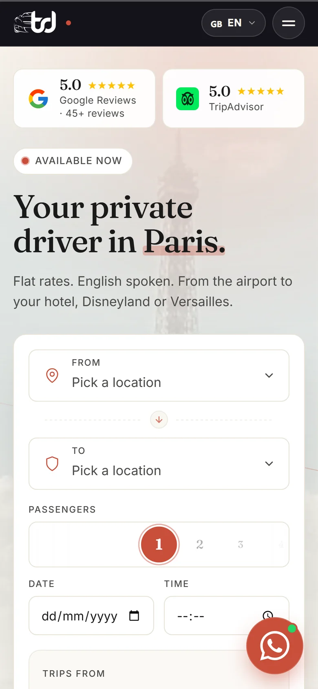
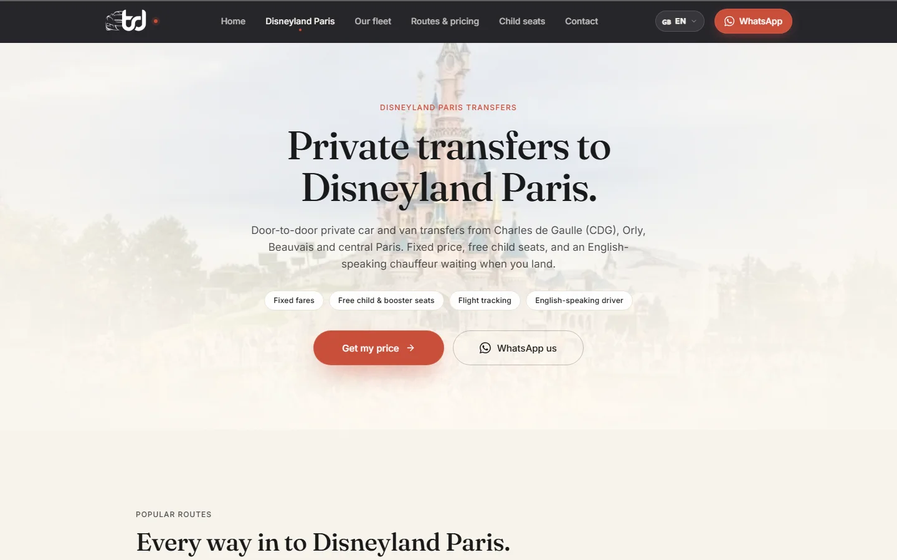
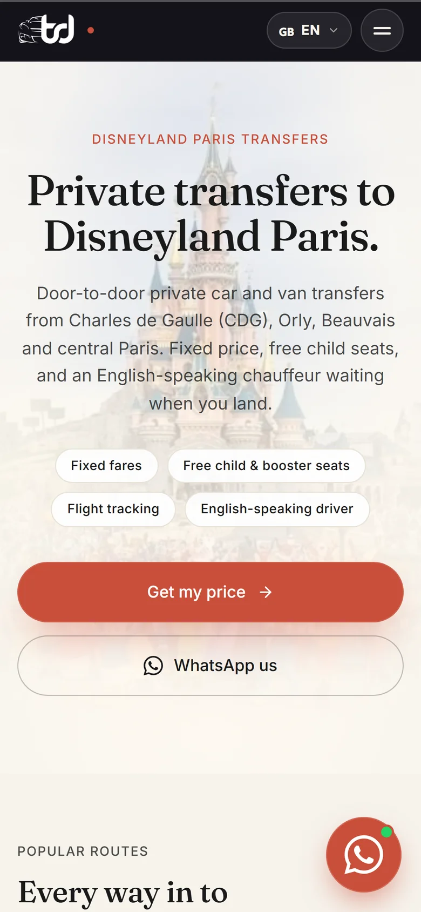
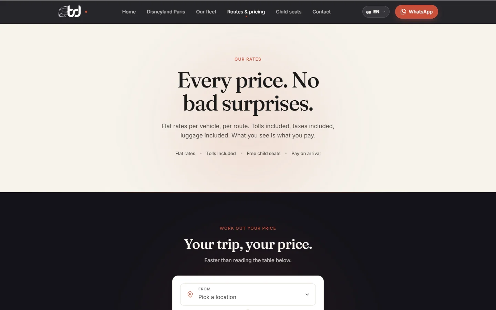
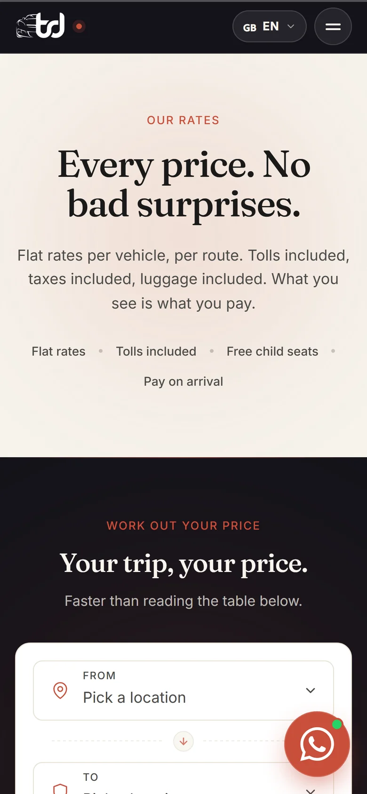
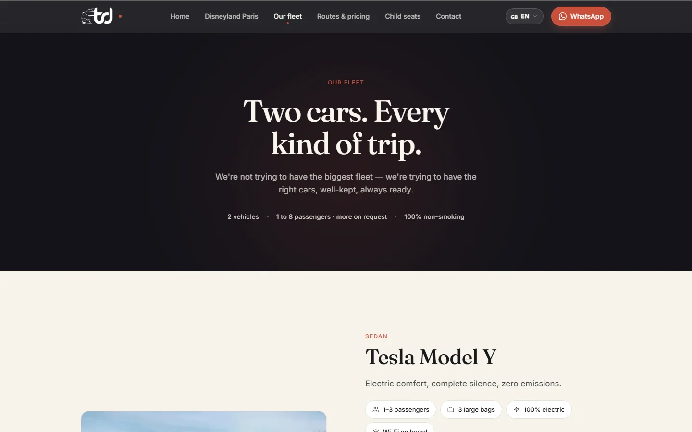
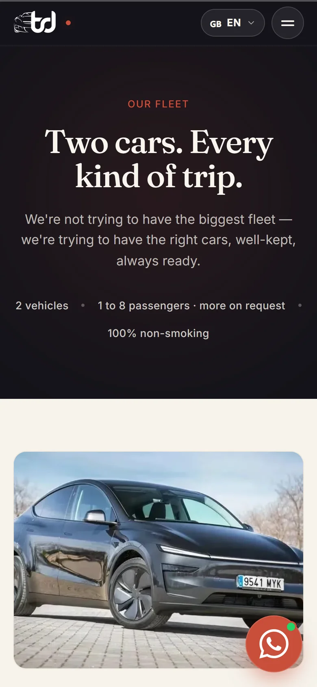

<div align="center">

# Driver Services

**A multilingual booking website for a private chauffeur service in Paris.**

[**thedriver.fr**](https://thedriver.fr) · Designed & developed by [**Alaa Younsi**](https://alaayounsi.vercel.app/)




</div>

---

## Overview

Driver Services is a private driver business that moves tourists around Paris:
airport transfers (CDG, Orly, Beauvais), Disneyland Paris, Versailles, train
stations and hourly chauffeur hire. Most customers are visitors who don't speak
French, book from their phone, and want to know the price before they book.

The site is built around that. A visitor picks a pickup point, a destination
and the number of passengers, sees a fixed all-inclusive price right away, and
books in a single step. The booking lands in the chauffeur's inbox and the
customer gets a confirmation email.

**Highlights**

- **Instant quotes.** A route and passenger matrix covers every pickup and
  destination pair and picks the right vehicle (car or van) automatically.
- **4 languages.** English, French, Spanish and Italian, each with its own
  translated URLs, not just translated text.
- **SEO landing pages** for the searches that bring customers in: airport
  transfers, Disneyland Paris, chauffeur hire, child seats, rates and fleet.
- **Booking and contact flows** that send branded HTML emails through Resend.
- **Private admin dashboard** for bookings, messages, blog posts, page copy and
  staff accounts, with permissions set per section.
- **Blog** managed from the dashboard, with per-post SEO and an RSS feed.

## Design

The look is quiet and premium. It should feel like a well-kept private car, not
a ride-hailing app.

- **Palette.** Warm cream paper (`#F8F5EE`), deep ink, and a warm near-black
  (`#14131A`) for contrast sections. A single terracotta accent (`#C94F3A`) is
  kept for calls to action, active states and focus rings.
- **Typography.** *Fraunces*, an editorial serif, for headlines, and *Inter*
  for the interface. The pairing reads as hospitality, not tech.
- **Texture and motion.** A faint paper grain, soft radial glows, and a short
  "Bienvenue à Paris" welcome animation that plays once per session. Sections
  reveal gently as you scroll, using shared easing and timing tokens.
- **Mobile first.** The quote picker sits right below the hero on phones,
  WhatsApp is always one tap away, and every tap target fits a thumb.
- **Trust up front.** Google and TripAdvisor ratings, "tolls included" and
  "no deposit" appear next to the price, where the booking decision happens.

All design decisions live as tokens in
[`src/styles/global.css`](src/styles/global.css). Tailwind v4 turns them into
utilities, so the whole site shares one visual system.

## Screenshots

| Desktop | Mobile |
| :---: | :---: |
|  |  |
|  |  |
|  |  |
|  |  |

## Tech stack

| Layer | Technology |
| --- | --- |
| Framework | [Astro 6](https://astro.build): static pages, with server rendering only where it's needed |
| Styling | [Tailwind CSS 4](https://tailwindcss.com) with a custom design-token theme |
| Language | TypeScript (strict), plus vanilla JS on the client, with no UI framework shipped to the browser |
| Database & auth | [Supabase](https://supabase.com): Postgres with Row-Level Security, Auth and Storage |
| Email | [Resend](https://resend.com) with hand-built responsive HTML templates |
| Hosting | [Vercel](https://vercel.com): static CDN plus serverless functions |
| Tooling | Sharp image pipeline (AVIF/WebP/JPEG), favicon and Open Graph generators, `@astrojs/check` |

## Performance

- **Static first.** Every marketing page is pre-rendered to plain HTML at
  build time. Only the booking API, the blog and the admin dashboard run on
  the server.
- **Almost no JavaScript.** Interactions are small vanilla scripts. There is
  no framework runtime to download or hydrate.
- **Modern images.** Every photo is served through `<picture>` as
  AVIF → WebP → JPEG, resized for its slot and stripped of metadata.
- **Caching.** Hashed build assets are cached for a year as `immutable`.
  Images use `stale-while-revalidate`.
- **Fonts.** Font servers are preconnected, stylesheets preloaded, and
  `font-display: swap` stops text from staying invisible while fonts load.

## SEO

- **Localized URLs** for every page in every language (`/fr/tarifs/`,
  `/es/tarifas/`, `/it/tariffe/`…), with `hreflang` alternates and an
  `x-default`.
- **Canonical URLs** and a single trailing-slash URL format, kept in sync
  between the Astro config, the route table and Vercel's 308 redirects, so no
  page gets indexed twice.
- **Structured data.** `TaxiService` JSON-LD with an `AggregateRating`, so
  search results can show the business and its rating.
- **Sitemap** with i18n alternates, `robots.txt`, and `noindex` on private and
  thank-you pages.
- **Open Graph and social cards** on every page, from a generated 1200×630
  image.
- **Internal linking.** Footer links for routes and destinations point to
  pre-filled quotes and dedicated landing pages.

## Security

- **Prices are checked on the server.** The booking API recalculates every
  quote from the same price table the site uses and never trusts a price sent
  by the browser.
- **Secrets stay on the server.** The Resend API key exists only in the
  serverless function. The browser only ever gets the public Supabase anon key.
- **Row-Level Security** on every table. Anonymous visitors can submit
  bookings and messages but can never read them. Staff access is checked in
  the database, section by section, through `SECURITY DEFINER` helper
  functions.
- **Input hardening.** Payloads are validated, required fields enforced and
  field lengths capped. Requests are rate-limited per IP, and forms post to
  the site's own domain.
- **HTTP headers.** HSTS, `X-Content-Type-Options`, `X-Frame-Options`,
  `Referrer-Policy` and a strict `Permissions-Policy`. The admin area is also
  kept out of search engines.
- **Privacy by default.** No analytics, trackers or third-party cookies, so
  no cookie banner is needed.

## Project structure

```
src/
  components/   UI sections (hero, quote picker, booking modal, fleet, FAQ…)
  config/       prices.js — the single source of truth for every tariff
  data/         routes, pickup points and vehicle definitions
  i18n/         en / fr / es / it strings and localized route table
  layouts/      BaseLayout — <head>, meta, hreflang, structured data
  lib/          Supabase client, email templates, admin helpers
  pages/        localized pages, blog, admin dashboard, /api/submit-form
  styles/       design tokens and global styles
supabase/       SQL migrations (schema, RLS, storage) and edge functions
scripts/        image optimizer, favicon and OG image generators
```

## Local development

Requires Node.js 22.12 or newer.

```sh
npm install
npm run dev      # http://localhost:4321
npm run build    # production build
```

Environment variables are listed in [`.env.example`](.env.example).
Deployment, DNS, email and Supabase setup are covered in
[HANDOVER.md](HANDOVER.md) and [SUPABASE-SETUP.md](SUPABASE-SETUP.md).

## Author

Designed and developed by **Alaa Younsi**: design, front end, back end,
database, SEO and deployment.

🌐 [alaayounsi.vercel.app](https://alaayounsi.vercel.app/)

## License

**© 2026 Alaa Younsi. All rights reserved.**

This repository is published for viewing only. You may not copy, reuse,
modify, redistribute or use any part of this project, including its code,
design, text or assets, without prior written permission.
See [LICENSE](LICENSE) for the full terms.
